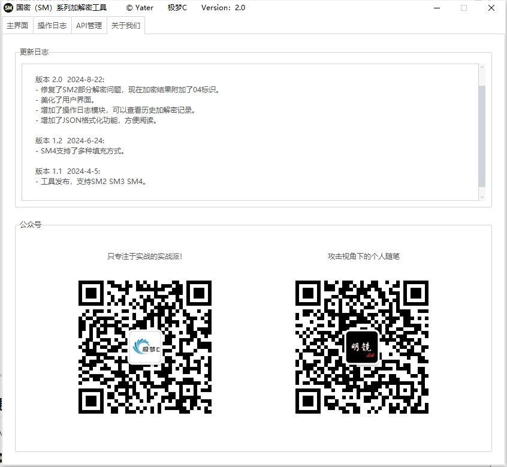
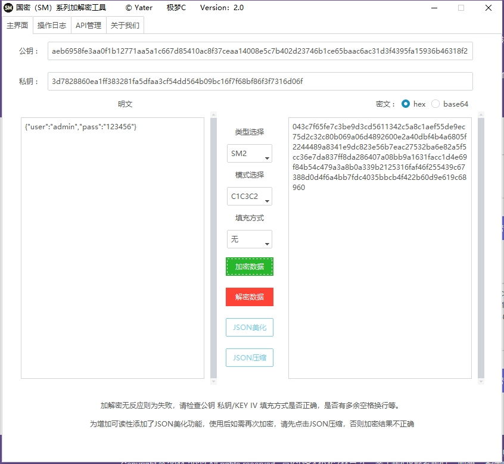
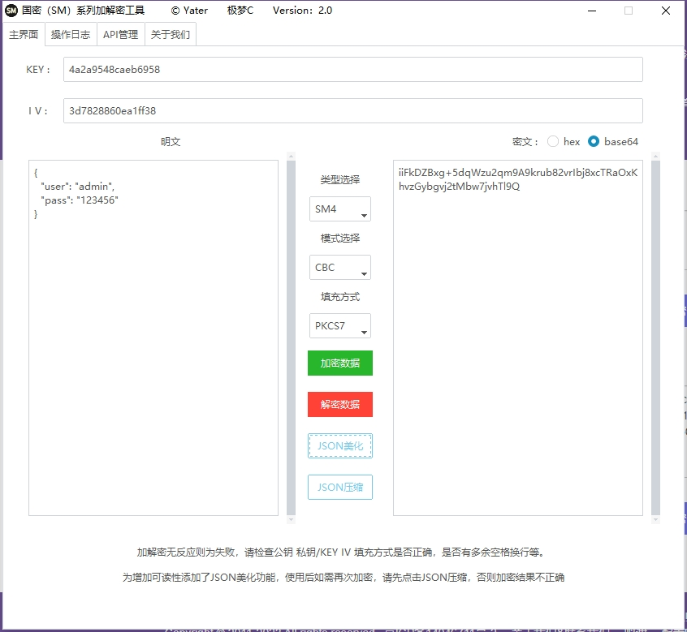
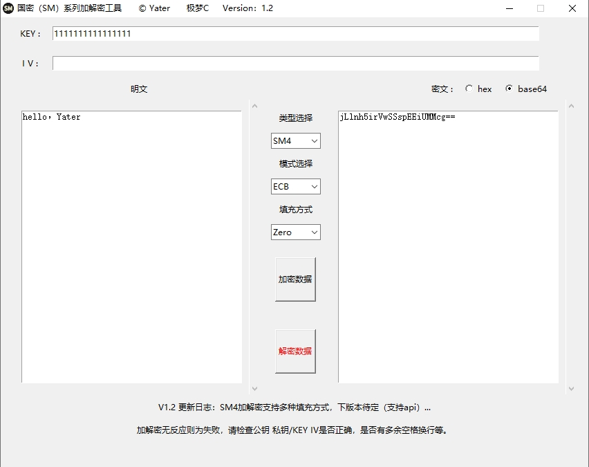
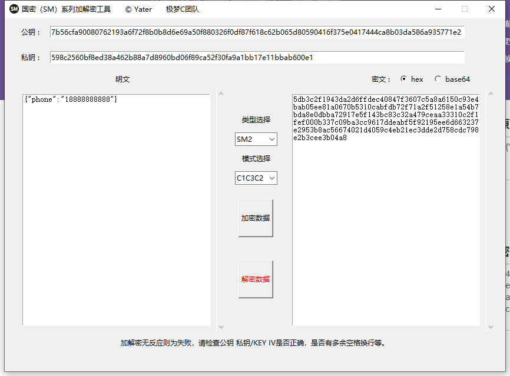
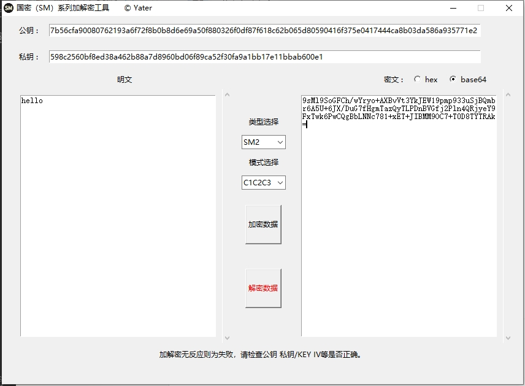
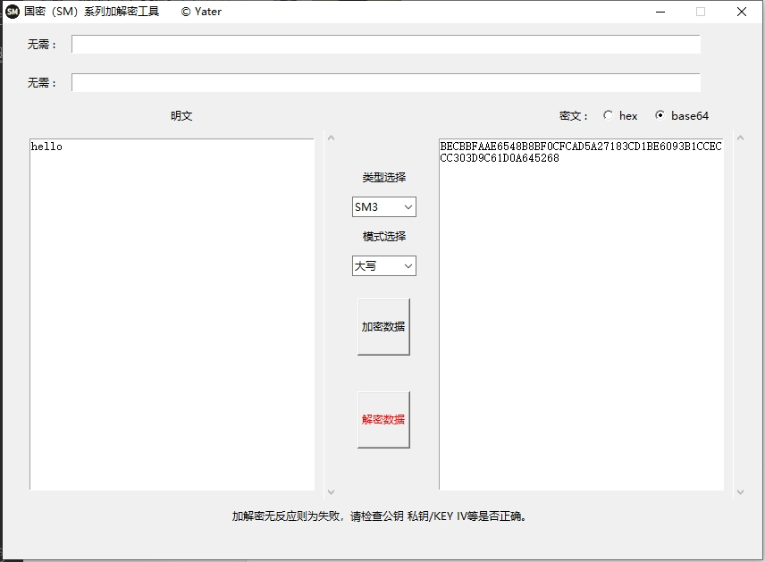
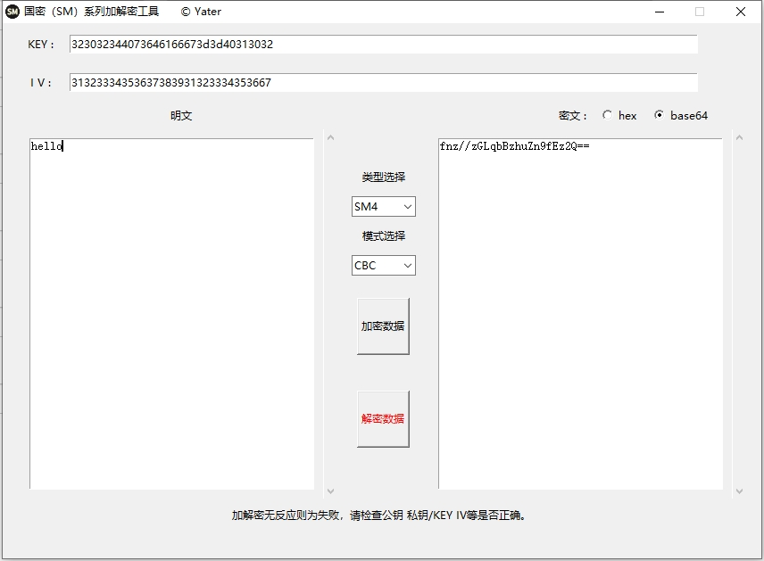

# 国密SM系列加解密图形化GUI工具
## 支持sm2加解密，sm3加密，sm4加解密
### sm2新标准（c1c3c2）、老标准（c1c2c3），sm4 ecb模式，cbc模式，输出输入支持hex和base64

现状：在测试过程中发现目前很多资产在数据传输过程中都对数据包进行了加密，特别是金融、能源等行业 
想要进行测试首先就需要还原加密方式或响应包进行解密。而国密（SM）系列是使用率也是日益增高，都在往国产化靠拢。 
举个简单例子：明文为{"data":"123456"}，加密逻辑为：sm4({"data":"123456"}+'随机字符串'+sm3({"data":"123456"})) 
平时大多数使用在线工具进行处理加解密数据，但有两个问题，一个是数据敏感性问题，如果使用的在线工具是通过api就有可能导致数据泄露问题。 
另一个则是在不出网的内网环境下测试，此工具就此诞生 

## 2.0版本发布 2024-8-23
修复了SM2部分解密问题，现在加密结果附加了04标识。 
美化了用户界面。 
增加了操作日志模块，可以查看历史加解密记录。 
增加了JSON格式化功能，方便阅读。  
 
 
 
 

## 更新日志 2024-06-14
SM4 新增多种主流填充方式
PKCS5、Zero、ISO10126、ANSIX.923

 

### 工具截图

 
 
 
 
